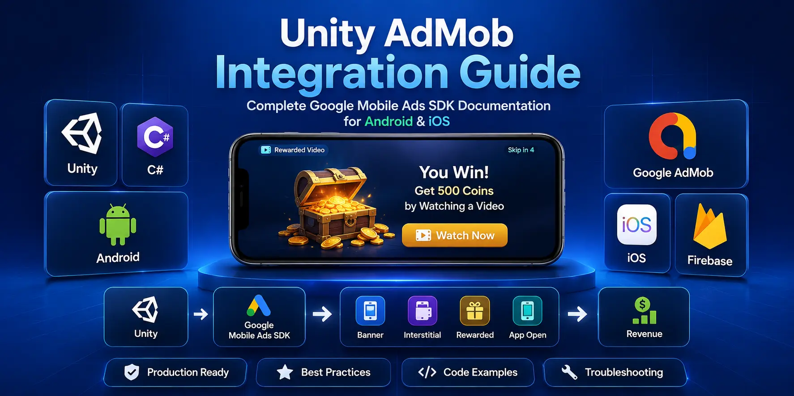

# Unity AdMob Integration Guide

<p align="center">
  
</p>

<p align="center">


</p>

A complete guide to integrating **Google Mobile Ads (AdMob)** into Unity games for **Android** and **iOS**. Learn how to implement Banner, Interstitial, Rewarded, and App Open Ads using clean architecture, production-ready practices, and reusable C# examples.

---

# 📚 Table of Contents

- [Overview](#-overview)
- [Features](#-features)
- [Repository Structure](#-repository-structure)
- [Quick Start](#-quick-start)
- [Documentation](#-documentation)
- [Requirements](#-requirements)
- [Roadmap](#-roadmap)
- [Useful Resources](#-useful-resources)
- [Related Repositories](#-related-repositories)
- [About Unity Source Code](#-about-unity-source-code)
- [License](#-license)

---

# 📖 Overview

This repository is designed for Unity developers who want to integrate **Google AdMob** into their mobile games using modern development practices.

Whether you're building your first mobile game or preparing a production release, this guide walks through the complete implementation process.

Topics covered include:

- Google Mobile Ads SDK setup
- Unity project configuration
- Banner Ads
- Interstitial Ads
- Rewarded Ads
- App Open Ads
- Best practices
- Common mistakes
- Troubleshooting
- Production-ready architecture

---

# ✨ Features

- Complete AdMob Integration Guide
- Android & iOS Support
- Production-ready folder structure
- Clean C# examples
- Banner Ads
- Interstitial Ads
- Rewarded Ads
- App Open Ads
- Troubleshooting Guide
- Best Practices
- Documentation-first approach
- Beginner Friendly

---

# 📂 Repository Structure

```text
unity-admob-integration-guide/

│── README.md
│── LICENSE
│── .gitignore
│
├── docs/
```

---

# 🚀 Quick Start

Clone the repository

```bash
git clone https://github.com/unitysourcecode2026/unity-admob-integration-guide.git
```

Open the documentation folder and follow the guides step by step.

---

## 📘 Documentation

| Guide | Open |
|-------|------|
| 📖 Introduction | [01-introduction.md](docs/01-introduction.md) |
| ⚙ Installation | [02-installation.md](docs/02-installation.md) |
| 🚀 Project Setup | [03-project-setup.md](docs/03-project-setup.md) |
| 🔑 SDK Initialization | [04-initialize-sdk.md](docs/04-initialize-sdk.md) |
| 📱 Banner Ads | [05-banner-ads.md](docs/05-banner-ads.md) |
| 🎯 Interstitial Ads | [06-interstitial-ads.md](docs/06-interstitial-ads.md) |
| 🎁 Rewarded Ads | [07-rewarded-ads.md](docs/07-rewarded-ads.md) |
| 📲 App Open Ads | [08-app-open-ads.md](docs/08-app-open-ads.md) |
| ⭐ Best Practices | [09-admob-best-practices.md](docs/09-admob-best-practices.md) |
| 🛠 Troubleshooting | [10-common-errors.md](docs/10-common-errors.md) |
| ❓ FAQ | [11-faq.md](docs/11-faq.md) |
| 🔗 Resources | [12-resources.md](docs/12-resources.md) |

---

# 💻 Requirements

- Unity 2022 LTS or newer
- Google Mobile Ads SDK
- Android Build Support
- iOS Build Support
- C#
- Google AdMob Account

---

# 🗺 Roadmap

- [x] Repository Setup
- [ ] Installation Guide
- [ ] SDK Initialization
- [ ] Banner Ads
- [ ] Interstitial Ads
- [ ] Rewarded Ads
- [ ] App Open Ads
- [ ] Best Practices
- [ ] Troubleshooting
- [ ] FAQ

---

# 🌐 Useful Resources

## Official Documentation

- Unity Documentation
- Google Mobile Ads SDK
- Google AdMob

## Unity Source Code

Professional Unity game templates, complete source code projects, and development tutorials.

🌍 **Website:** <https://unitysourcecode.net>

🎮 **Unity Game Templates:** <https://unitysourcecode.net/products>

📰 **Unity Blog:** <https://unitysourcecode.net/blog>

---

# 🔗 Related Repositories

Continue learning Unity with these repositories.

- 📱 Unity Mobile Optimization Guide
- 🔔 Unity Push Notifications Guide
- 💾 Unity Save & Load System Guide
- 📦 Unity ScriptableObject Examples
- 🎮 Unity Game Projects

---

# ❤️ About Unity Source Code

Unity Source Code publishes practical Unity development resources including game templates, source code projects, technical guides, and tutorials to help developers build mobile games faster.

Explore more:

🌍 Website

https://unitysourcecode.net

🎮 Browse Unity Game Source Codes

https://unitysourcecode.net/products

📰 Read Unity Development Articles

https://unitysourcecode.net/blog

If this repository helped you:

⭐ Star the repository

🍴 Fork it

📢 Share it with fellow Unity developers

---

# 🤝 Contributing

Contributions, improvements, documentation updates, and bug fixes are welcome.

If you find an issue, feel free to open an Issue or submit a Pull Request.

---

# 📄 License

This project is licensed under the MIT License.

---

<p align="center">

Made with ❤️ by <b>Unity Source Code</b>

🌍 https://unitysourcecode.net

</p>
